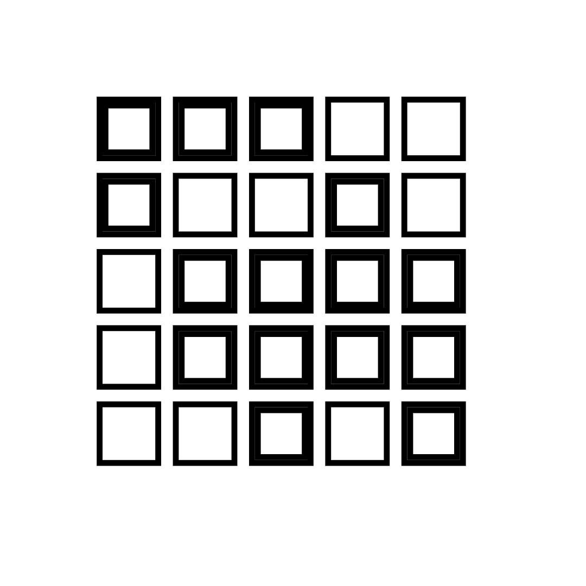
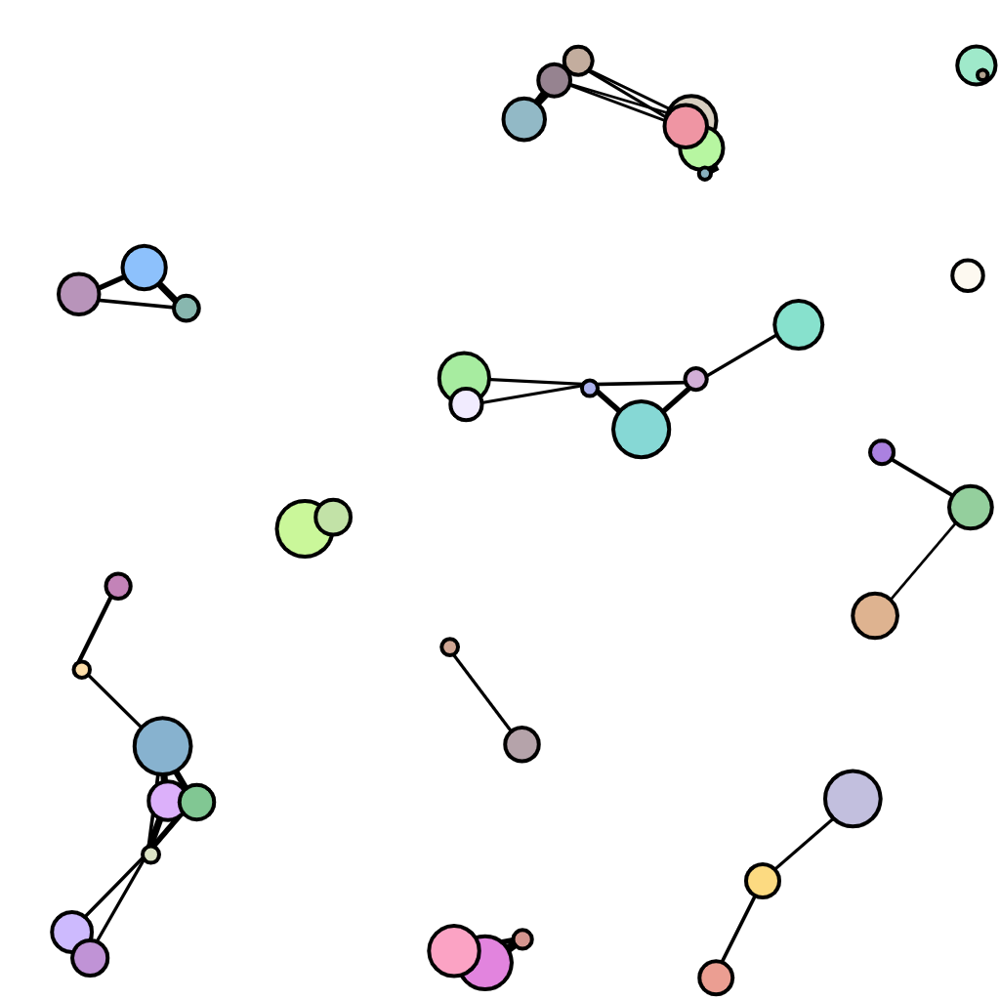

# creative-coding-class

Code following this online class:

[Creative Codeing with JavaScript](https://www.domestika.org/en/courses/2729-creative-coding-making-visuals-with-javascript/course)

# canvas-sketch Chooser

The project implements a sketch-switcher (chooser.js).  Each sketch does not call canvasSketch itself, but instead just exports
a `name`, `sketch`, and (optional) `createPane` method.

The chooser then managers stopping any previous animation going on
and removing the canvas that was used (since canvas-sketch by default will add another one to the body).

*It may be possible that the sketch-manager from canvas-sketh could be used more intelligently, but this was a quick and easy
way to deal with it.*

## Sample Sketches

<video width="400" height="400" autoplay>
  <source src="./snapshots/2021.10.08-01.14.41.mp4" type="video/mp4">
</video>

